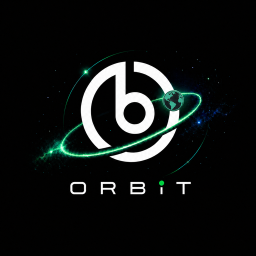
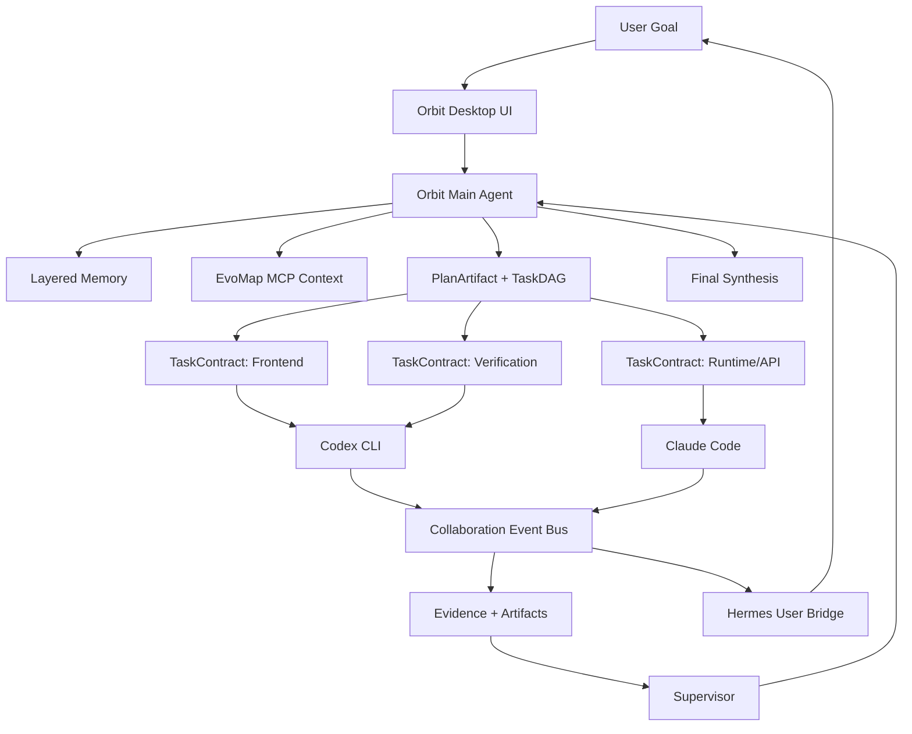
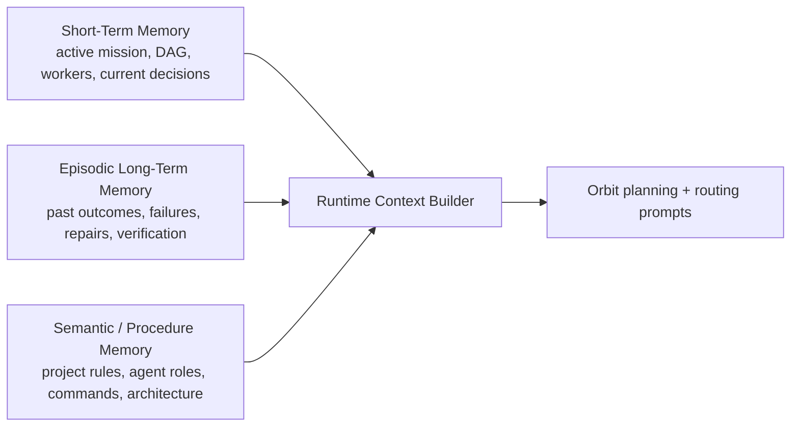

# Orbit

> Agent Mission Control for handoff, collaboration, memory, and self-evolving software work.



[](LICENSE)
[](https://www.electronjs.org/)
[](https://react.dev/)
[](https://www.typescriptlang.org/)
[](#local-first)

## 中文项目介绍

Orbit 是一个面向真实软件项目的多 Agent Mission Control 工作台，核心解决的问题是：AI 编程工具很强，但单个 Agent 经常会因为额度用完、上下文断裂、任务拆不清、协作边界混乱或交付结果不可验证而中断。Orbit 把这些零散的 Agent 会话升级成一套可接力、可协作、可追踪、可沉淀记忆的本地项目操作系统。

它的最大亮点是 **Agent 接力** 和 **Agent 协作**。当 Claude Code 用到一半额度不足，Codex CLI 可以在同一个工作区、同一个项目目标、同一套任务上下文和历史 Memory 里继续执行；当任务足够复杂时，Orbit 主 Agent 会先生成 `PlanArtifact / TaskDAG / TaskContract`，再把有边界的任务派给 Codex CLI、Claude Code 等执行 Agent，并通过文件范围、完成标准、验证命令、协作事件和交付证据来约束它们，避免多个 Agent 各干各的。

Orbit 的 Memory 系统分为短期任务状态、情节长期记忆、语义/流程记忆三层。它不会粗暴地把所有聊天记录塞给每个 Agent，而是把当前任务 DAG、历史失败/修复经验、项目规则、Agent 能力、验证结果和可复用流程筛选成下一次规划真正需要的上下文。这让新 Agent 可以接住前一个 Agent 的工作，而不是重新问一遍、重新猜一遍。

Orbit 还深度融合 EvoMAP 自进化 MCP。主 Agent 在规划前可以通过 EvoMAP 拉取 Genes、Capsules、Recipes、Assets 和语义复用上下文，把外部已经验证过的经验注入任务拆解与执行策略中。Orbit 不是把 EvoMAP 当成一个隐藏开关，而是把它放在 Integration / Evolution 层：设置页可以看到 OAuth 状态、MCP 探测、重置授权和连接状态；规划层会把 EvoMAP 的可复用知识转化为主 Agent 的预规划上下文。

简单说，Orbit 想解决的是 AI 编程从“单次聊天”到“连续项目交付”的断层：它让 Codex、Claude Code、Hermes 和 EvoMAP 在统一工作区里形成一套能计划、能接力、能协作、能验证、能记忆、能进化的 Agent 工作流。

Orbit is a local-first desktop command center for running real project work across multiple AI coding agents.

It is not another multi-model chat shell. Orbit is a main-agent orchestration layer: it accepts a project goal, reads workspace context and memory, builds a task DAG, assigns bounded contracts to worker agents such as Codex CLI and Claude Code, monitors evidence, verifies output, and synthesizes the final result.

The core product idea is simple:

**when one agent runs out of quota, context, patience, or reliability, another agent should be able to pick up the mission without starting over.**

Orbit turns AI coding from isolated chats into an operational workflow:

- **Agent Relay**: switch from Claude Code to Codex, or Codex to Claude Code, while preserving the project goal, workspace, task context, evidence, and memory.
- **Agent Collaboration**: let multiple agents work on one shared project through explicit task contracts instead of vague parallel prompts.
- **Human Bridge**: Hermes can keep the user informed, relay approvals, and surface remote instructions without becoming a risky coding worker.
- **Memory-Driven Continuity**: active mission state, prior outcomes, lessons, failures, and reusable operating rules become part of the next run.
- **EvoMap Self-Evolution**: Orbit can inject external Genes, Capsules, Recipes, and reuse context through EvoMap MCP before planning.

## Why Orbit

Modern coding agents are powerful, but they still break down in predictable ways:

- one agent loses context after a long session;
- subscription quota ends in the middle of implementation;
- two agents modify the same project without understanding each other's contracts;
- a worker says "done" but produces no artifact;
- the user has to manually explain the same workspace history over and over;
- planning, execution, verification, and handoff live in separate chats.

Orbit is designed to make those failures survivable.

It provides a shared mission layer above individual agents. Codex CLI and Claude Code remain excellent specialists, but Orbit owns the project-level coordination: what needs to be done, who is doing it, what files are in scope, what evidence was produced, what failed, what should be retried, and what memory should be carried into the next run.

## Highlight Features

### Agent Relay

Orbit's relay mode is built for the messy reality of AI tool limits.

If Claude Code hits quota, Codex can continue from the same workspace. If Codex stalls, Claude Code can take the next contract. Orbit preserves:

- workspace selection;
- conversation and task history;
- project goal and active mission state;
- task contracts and file scopes;
- execution evidence and artifacts;
- Memory entries from previous dispatches;
- provider/model routing configuration.

This makes Orbit especially useful for long-running software tasks where "start a fresh chat" is too expensive.

### Agent Collaboration

Orbit can run a main-agent orchestration flow:

1. The user gives Orbit a project goal.
2. Orbit reads workspace context, memory, and optional EvoMap MCP context.
3. Orbit creates a `PlanArtifact` containing a `TaskDAG`.
4. Each task becomes a `TaskContract` with scope, done criteria, verification, and dependencies.
5. Codex CLI, Claude Code, and other execution workers receive bounded work.
6. Orbit records worker activity, artifacts, verification results, and blockers.
7. Orbit synthesizes the final answer and recommends follow-up work.

Workers operate in one unified project workspace, but their responsibilities are separated by contracts and file scopes. The goal is not "everyone talk at once"; the goal is coordinated progress with inspectable evidence.

### Hermes User Bridge

Hermes is treated as a communication bridge, not a default code writer.

Orbit can route user-facing events to Hermes so the user gets progress updates, completion notices, failure summaries, and approval requests. That keeps the execution pool cleaner:

- Codex CLI and Claude Code do implementation work.
- Orbit plans, supervises, verifies, and synthesizes.
- Hermes keeps the human in the loop.

### Evidence-First Verification

Orbit does not rely only on final chat text.

Worker results can be verified against:

- generated files inside the declared `fileScope`;
- artifact previews and local preview URLs;
- activity tails when final worker text is empty;
- verification commands and task-specific done criteria;
- supervisor decisions and mission outcomes.

This prevents a common multi-agent failure mode: a worker card looks active, but the final output is blank or unverifiable.

## Architecture

Orbit is organized as a mission-control stack.



### Product Layers

Orbit intentionally separates the product into clear layers:

- **Mission Layer**: goal intake, mission identity, active state, final synthesis.
- **Contract Layer**: `PlanArtifact`, `TaskDAG`, `TaskContract`, dependencies, scope, done criteria.
- **Runtime Layer**: local CLI adapters, HTTP providers, stdio workers, local proxy.
- **Evidence Layer**: artifacts, previews, worker activity tails, verification results.
- **Integration Layer**: EvoMap MCP, provider routing, local desktop protocols.
- **Memory/Evolution Layer**: STM, episodic LTM, semantic/procedure memory, reusable lessons.
- **UI Projection Layer**: workspace conversations, task cards, routing settings, EvoMap status, deletion and history controls.

See [docs/ORBIT_PRODUCT_ARCHITECTURE.md](docs/ORBIT_PRODUCT_ARCHITECTURE.md) for the deeper product architecture.

## Memory System

Orbit uses layered memory instead of dumping one giant chat history into every agent.



### Short-Term Memory

STM tracks what is happening now:

- current workspace;
- active conversation;
- active mission;
- current task DAG;
- running workers;
- route context;
- recent decisions and blockers.

### Episodic Long-Term Memory

Episodic memory stores what happened before:

- which dispatches worked;
- which agents failed or stalled;
- what files or artifacts were created;
- what verification passed or failed;
- what repairs were needed;
- what lessons should influence the next plan.

### Semantic and Procedure Memory

Semantic/procedure memory captures durable operating rules:

- project conventions;
- role boundaries;
- command recipes;
- coding-session rules;
- architecture decisions;
- reusable prompts and task-contract practices.

This is the layer that lets Orbit hand a future agent the right constraints without replaying a huge private chat transcript.

More detail: [docs/MEMORY_SYSTEM.md](docs/MEMORY_SYSTEM.md).

## RAG and Retrieval

Orbit uses retrieval in a practical, product-oriented way:

- **Memory retrieval**: active mission state and long-term lessons are selected into planning/routing context.
- **Workspace retrieval**: the project workspace, file scopes, artifacts, and previewable outputs are used as execution evidence.
- **EvoMap MCP retrieval**: Orbit can call EvoMap MCP to search reusable Recipes, Assets, Genes, Capsules, and semantic knowledge before planning.
- **RAG-like prompt grounding**: retrieved memory and EvoMap context are injected into the main-agent planning prompt so the next agent starts from accumulated knowledge instead of blank context.

Orbit currently focuses on durable local memory plus EvoMap MCP retrieval. A bundled vector index is not required for the current desktop workflow, but the architecture leaves room for a local embedding index later.

## Local First

Orbit is designed for local developer machines:

- Electron desktop app;
- local project workspaces;
- local userData storage;
- local WebSocket Hub on `127.0.0.1:9527`;
- local OpenAI/Anthropic-compatible proxy on `127.0.0.1:9528`;
- local CLI execution for Codex CLI and Claude Code;
- encrypted provider keys via Electron safeStorage;
- no requirement to upload your project workspace to a hosted backend.

## Supported Agents

### Main Agent

| Agent | Role |
| --- | --- |
| Orbit | Planning, task decomposition, routing, supervision, verification, synthesis |

### Execution Workers

| Agent | Best Use |
| --- | --- |
| Codex CLI | Code generation, refactoring, tests, command-line execution |
| Claude Code | Deep code reasoning, implementation, review, long-form repair |

### User Bridge

| Agent | Best Use |
| --- | --- |
| Hermes | Progress reports, approval relay, user notifications, remote instruction bridge |

The product keeps Hermes out of the default code-execution pool so notification and implementation responsibilities do not blur.

## Provider and Runtime Model

Orbit supports two execution paths:

### StdIO Local CLI

StdIO means Orbit spawns a local CLI process and sends task prompts through the process boundary.

This is ideal for:

- using Codex CLI with the user's local login/session;
- using Claude Code with the user's local subscription login;
- avoiding duplicate API-key configuration for worker agents;
- continuing when one web subscription or CLI session reaches its limit.

### HTTP Provider Routing

HTTP provider mode lets Orbit call model APIs and OpenAI-compatible relays directly.

Supported provider families include:

- OpenAI / OpenAI-compatible;
- Anthropic;
- Gemini;
- DeepSeek;
- MiniMax;
- OpenRouter;
- custom relay endpoints with manually specified model IDs.

Orbit also exposes a local compatibility proxy so tools can target a stable local endpoint while Orbit handles provider routing.

## EvoMap Self-Evolution MCP

Orbit includes first-class EvoMap integration:

- OAuth start/callback/status/probe/reset endpoints;
- visible EvoMap status card in Settings;
- MCP probing;
- pre-planning context injection;
- support for EvoMap Genes, Capsules, Recipes, Assets, and semantic reuse workflows.

EvoMap gives Orbit a path toward self-evolving agent behavior: successful patterns can become reusable context for future missions instead of remaining trapped in one chat.

## Technology Stack

| Area | Technology |
| --- | --- |
| Desktop Shell | Electron 33 |
| UI | React 18, TypeScript, custom glass UI |
| Build | electron-vite, Vite, electron-builder |
| Runtime | Node.js, Electron main process, local HTTP/WebSocket servers |
| Agent Transport | StdIO adapters, HTTP providers, OpenAI-compatible proxy |
| Coordination | PlanArtifact, TaskDAG, TaskContract, CollaborationBus |
| Memory | STM, episodic LTM, semantic/procedure LTM, local JSON-backed stores |
| Retrieval | Memory selection, workspace artifact/evidence retrieval, EvoMap MCP semantic/reuse context |
| Verification | Vitest, TypeScript typecheck, runtime syntax checks, task evidence validation |
| Security | local-only ports, safeStorage-encrypted provider keys, token-gated local WebSocket access |
| Packaging | macOS/Windows/Linux targets through electron-builder |

## Repository Map

```text
src/main/
  hub/                 orchestration, agents, dispatcher, collaboration bus
  providers/           model providers, endpoint normalization, health checks
  routing/             local OpenAI/Anthropic-compatible proxy
  openagents/          optional sidecar compatibility bridge
  memory-library.ts    memory catalog and runtime memory helpers
  orbit-runtime.cjs    packaged runtime source used by Electron main

src/renderer/
  glass/               Orbit UI system, sidebar, titlebar, orchestration view
  screens/             Chat, Settings, Tasks, Home, Skills

docs/
  MEMORY_SYSTEM.md
  ORBIT_PRODUCT_ARCHITECTURE.md
  AGENTIC.md
  HANDOFF.md

scripts/
  sync-orbit-runtime.mjs
```

## Quick Start

```bash
git clone https://github.com/gaowei90098-creator/orbit-agent-workbench.git
cd orbit-agent-workbench
npm install
npm run dev
```

For a production-style local build:

```bash
npm run typecheck
npm test
npm run build
npm run unpack
```

The unpacked macOS app is generated under:

```text
dist/mac-arm64/Orbit.app
```

## Using Orbit

1. Add a workspace root for your project.
2. Configure Orbit main-agent provider/model in Settings.
3. Configure Codex CLI and/or Claude Code as local StdIO workers.
4. Optional: connect EvoMap MCP from the EvoMap card in Settings.
5. Start a conversation inside the workspace.
6. Use relay mode for one-agent-at-a-time continuation.
7. Use orchestration mode when the task needs decomposition, collaboration, verification, and synthesis.

## What Makes Orbit Different

Orbit is built around project continuity.

Most AI coding tools optimize the single chat. Orbit optimizes the mission:

- the mission survives agent switches;
- the workspace survives conversation switches;
- the task DAG survives worker failures;
- the evidence survives empty final messages;
- the memory survives quota exhaustion;
- the human stays informed through a bridge agent.

That is the difference between "AI chat" and "Agent Mission Control."

## Roadmap

- Mission diagnostics panel for DAG, evidence, blockers, and supervisor decisions.
- Richer task claim / soft-lock board for collaborative worker execution.
- Deeper EvoMap evolution loop for promoting successful missions into reusable Genes/Capsules.
- Optional local vector index for workspace-level retrieval.
- Stronger handoff automation when Supervisor decides a worker needs rescue.
- Release installers and notarized macOS distribution.

## License

MIT. See [LICENSE](LICENSE).
